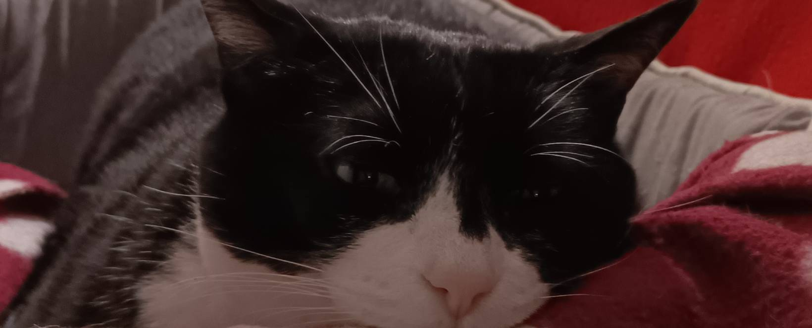
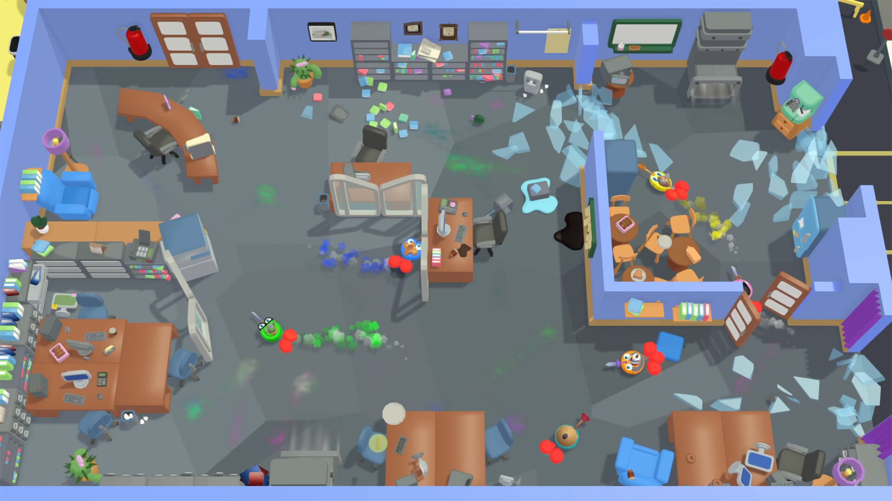

Hello! I'm Arreme or Arnau Reig, a game developer and an embedded programmer. You will have to read my career to understand why I have a passion for this two, seemingly distinct topics😉

One of my passions is learning new stuff, getting my hands dirty and teaching other people about what I have discovered. Hence the reason I have started this website. Please don't hesitate to contact me for questions!

I also love scenical arts like dancing and theater, which I practice as a hobby.

As a last reminder I like to tell to people: You can learn from everything and from everyone. Stay humble, and listen to what others say. Like this music recommendation I'm about to say.



## Career

Studied a double degree in Computer Science and Game Design. During my studies I got interested in digital tweens, IoT and embedded development. I paired my studies with diferent jobs, which include developing C firmware in an IoT company and C++ code for an AR/VR glasses for people with low vision. You can check my Linkedin for more information.

In 2023 a little game we made back in University got selected for an Incubation program. That's when we decided to start creating [Roombattle](https://dustgames.es/), which is still in development and hopefully it will be out this 2025.

## Projects

### Roombattle

One of my main projects is [Roombattle](https://dustgames.es/). A casual multiplayer game where you have to pop the balloons of your friends in dynamic rooms full of obstacles.
My main role has been dealing with the core mechanics of the game (Movement, player interaction) as well as providing a clear pipeline for the entire team (Map structure, folder structure, tooling and technological planning). Furthermore, I have been in charge on developing and porting the core mechanics to online, using [Netick](https://netick.net/).

### C++ Discord Bot

To learn about C++ and kickstart my career as a C++ developer, In 2023 I started developing a minimalistic RPG for a Discord Bot. I had to design the entire structure and apply different patterns for the API design and flexibility. This project allowed me to start a position as a junior C++ developer in Biel Glasses back in 2025
